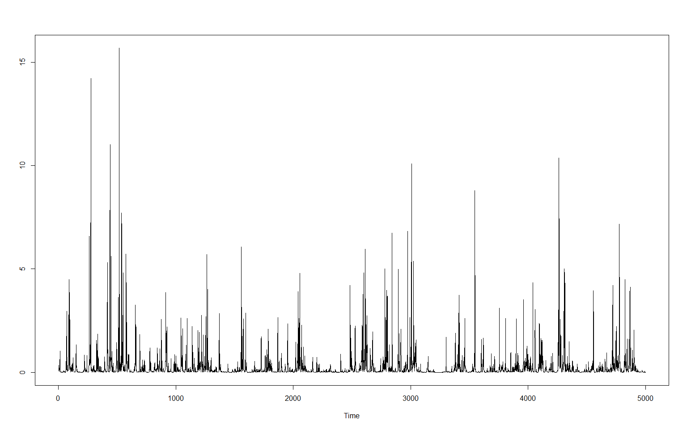
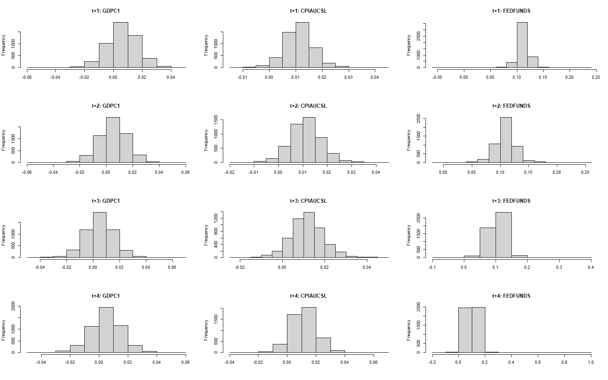

bayesianVARs: Hierarchical shrinkage priors
================
Luis Gruber
16 5 2022

Estimation of Bayesian vectorautoregressions. Implements several modern
hierarchical shrinkage priors, amongst them Dirichlet-Laplace prior,
Hierarchical Minnesota, Horseshoe prior, Normal-Gamma prior,
$R^2$-induced-Dirichlet-decomposition prior and Stochastic Search
Variable Selection prior.

# Installation

Install directly from GitHub.

``` r
devtools::install_github("luisgruber/bayesianVARs")
```

# Getting started

Data used in the following example is from Michael W. McCracken and
Serena Ng, “FRED-QD: A Quarterly Database for Macroeconomic Research,”
Federal Reserve Bank of St. Louis Review, First Quarter 2021, pp. 1-44.
<https://doi.org/10.20955/r.103.1-44>.

``` r
set.seed(537)
# load package
library(bayesianVARs)

# Some data (from FRED-MD database)
data <- dat_growth[,c("GDPC1", "CPIAUCSL", "FEDFUNDS")]

# Data for estimation
Y_est <- data[1:100,]

# Specify prior for reduced-form VAR coefficients (with default settings)
prior <- "HS" # or "DL", "R2D2", "NG", "SSVS", "HMP", "normal"
priorPHI <- specify_priorPHI(prior = prior)

# Specify prior for L (Decomposition of variance-covariance matrix in the form of t(L^(-1))%*%D_t%*%L^(-1), where L is upper triangular)
priorL <- specify_priorL(prior = "HS")

# Estimate VAR(2) with stochastic volatility
mod <- bvar(Yraw = Y_est, p = 2, draws = 5000, burnin = 1000,
            priorPHI = priorPHI, priorL = priorL, SV = TRUE, progressbar = FALSE)

# Posterior summary of PHI
summary(mod)
```

    ## 
    ## Posterior median of reduced-form coefficients:
    ##                GDPC1   CPIAUCSL   FEDFUNDS
    ## GDPC1.l1     0.02668  0.0323357  0.1026262
    ## CPIAUCSL.l1 -0.08011  0.5717350  0.2475045
    ## FEDFUNDS.l1 -0.01399  0.1548698  1.2163109
    ## GDPC1.l2     0.03448 -0.0313394  0.0478089
    ## CPIAUCSL.l2 -0.02636  0.2720078  0.0300708
    ## FEDFUNDS.l2 -0.06199 -0.1357813 -0.2922431
    ## intercept    0.01587  0.0006769  0.0004525
    ## 
    ## Posterior interquartile range of of reduced-form coefficients:
    ##                GDPC1 CPIAUCSL FEDFUNDS
    ## GDPC1.l1    0.089685 0.055069 0.071980
    ## CPIAUCSL.l1 0.202458 0.164284 0.226991
    ## FEDFUNDS.l1 0.064626 0.063592 0.154383
    ## GDPC1.l2    0.097866 0.057406 0.075514
    ## CPIAUCSL.l2 0.138444 0.177491 0.131037
    ## FEDFUNDS.l2 0.089130 0.071832 0.156396
    ## intercept   0.003513 0.001784 0.002273
    ## 
    ## Posterior median of contemporaneous coefficients:
    ##          GDPC1   CPIAUCSL   FEDFUNDS
    ## GDPC1        -  0.0006288 -0.1068319
    ## CPIAUCSL     -          - -0.1777961
    ## FEDFUNDS     -          -          -
    ## 
    ## Posterior interquartile range of contemporaneous coefficients:
    ##          GDPC1 CPIAUCSL FEDFUNDS
    ## GDPC1        -  0.03299  0.06995
    ## CPIAUCSL     -        -  0.28053
    ## FEDFUNDS     -        -        -

``` r
# Visualize Posterior of PHI
plot(mod$PHI, summary = "median", add_numbers = FALSE, colorbar = TRUE)
```

<!-- -->

``` r
plot(mod$PHI, summary = "IQR", add_numbers = FALSE, colorbar = TRUE)
```

<!-- -->

``` r
# Traceplot of global shrinkage parameters
ts.plot(mod$phi_hyperparameter$zeta1, ylab="")
```

<!-- -->

``` r
ts.plot(mod$l_hyperparameter$zeta, ylab="")
```

<!-- -->

``` r
# Simulate from predictive density and compare to ex-post realized value by 
# means of log predictive likelihood

# get ex-post observed data
Y_obs <- data[101:104,]
# predict
pred <- predict(mod, nsteps = 4, LPL = TRUE, Y_obs = Y_obs ,LPL_VoI = c("CPIAUCSL", "FEDFUNDS"))

# Histograms of predictive densities
par(mfrow=c(4,3))
for (i in paste0("t+",1:4)) {
  for(j in c("GDPC1" ,"CPIAUCSL", "FEDFUNDS")){
  hist(pred$predictions[,i,j], main = paste0(i,": ",j), xlab = "")
}
}
```

<!-- -->

``` r
# Summary of predictive evaluation
summary(pred)
```

    ## 
    ## LPL:
    ##   t+1   t+2   t+3   t+4 
    ## 9.531 9.632 9.778 9.530 
    ## 
    ## Marginal joint LPL of CPIAUCSL & FEDFUNDS:
    ##   t+1   t+2   t+3   t+4 
    ## 5.879 6.086 6.153 6.272 
    ## 
    ## Marginal univariate LPLs:
    ##     GDPC1 CPIAUCSL FEDFUNDS
    ## t+1 3.694    4.307    1.508
    ## t+2 3.585    4.161    1.843
    ## t+3 3.608    3.971    2.020
    ## t+4 3.149    3.653    2.258
    ## 
    ## Prediction quantiles:
    ## , , GDPC1
    ## 
    ##           t+1       t+2       t+3       t+4
    ## 5%  -0.011163 -0.012450 -0.012393 -0.012584
    ## 50%  0.006337  0.005339  0.005079  0.005097
    ## 95%  0.023225  0.022662  0.021890  0.022750
    ## 
    ## , , CPIAUCSL
    ## 
    ##          t+1      t+2        t+3       t+4
    ## 5%  0.002879 0.000969 -0.0009913 -0.003099
    ## 50% 0.011207 0.011181  0.0114202  0.011445
    ## 95% 0.020037 0.022426  0.0245315  0.026187
    ## 
    ## , , FEDFUNDS
    ## 
    ##         t+1     t+2     t+3     t+4
    ## 5%  0.09541 0.07858 0.06249 0.04869
    ## 50% 0.11293 0.10920 0.10469 0.10017
    ## 95% 0.12861 0.13582 0.14174 0.14516
