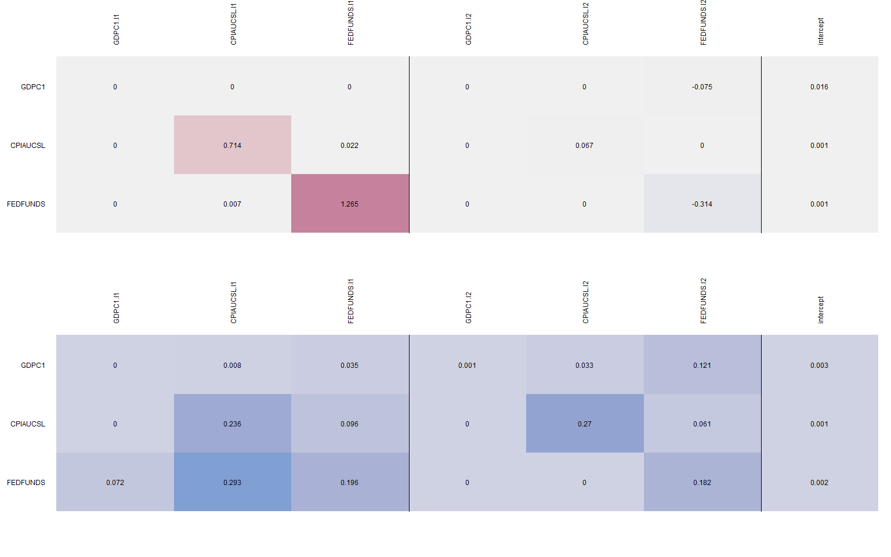
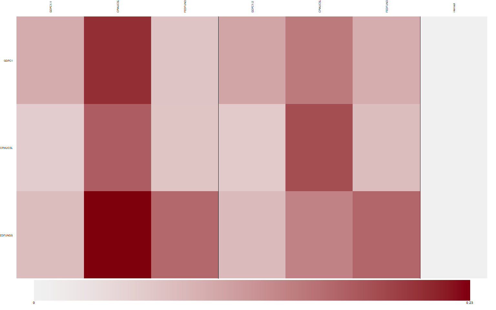
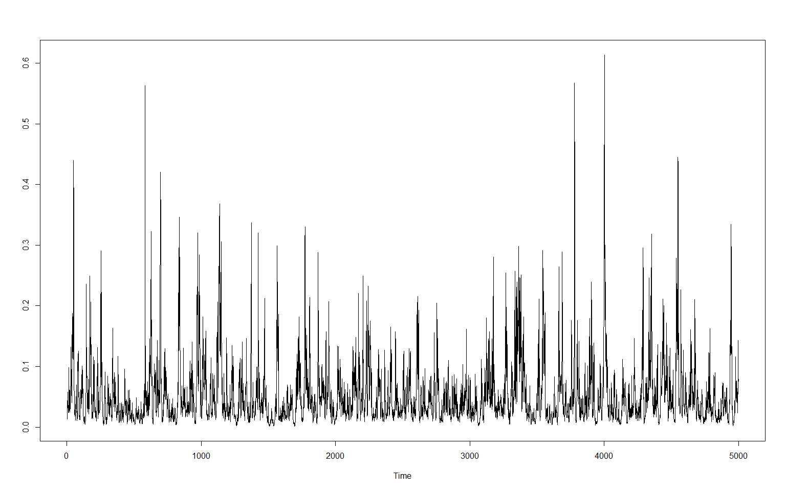

bayesianVARs: Hierarchical shrinkage priors
================
Luis Gruber
16 5 2022

Estimation of Bayesian vectorautoregressions. Implements several modern
hierarchical shrinkage priors, amongst them
-induced-Dirichlet-decomposition
(R2D2) prior, Dirichlet-Laplace (DL) prior, Stochastic Search Variable
Selection (SSVS) and the Hierarchical Minnesota prior.

# Installation

Install directly from GitHub.

``` r
devtools::install_github("luisgruber/bayesianVARs")
```

# Getting started

Data used in the following example is from Michael W. McCracken and
Serena Ng, “FRED-QD: A Quarterly Database for Macroeconomic Research,”
Federal Reserve Bank of St. Louis Review, First Quarter 2021, pp. 1-44.
<https://doi.org/10.20955/r.103.1-44>.

``` r
set.seed(537)
# load package
library(bayesianVARs)

# Some data (from FRED-MD database)
data <- dat_growth[,c("GDPC1", "CPIAUCSL", "FEDFUNDS")]

# Data for estimation
Y_est <- data[1:100,]

# Specify prior for reduced-form VAR coefficients (with default settings)
prior <- "R2D2" # or "DL", "SSVS", "HMP", "normal"
priorPHI <- specify_priorPHI(prior = prior)

# Specify prior for L (Decomposition of variance-covariance matrix in the form of t(L^(-1))%*%D_t%*%L^(-1), where L is upper triangular)
priorL <- specify_priorL(prior = "DL")

# Estimate VAR(2) with stochastic volatility
mod <- bvar(Yraw = Y_est, p = 2, draws = 5000, burnin = 1000,
            priorPHI = priorPHI, priorL = priorL, SV = TRUE, progressbar = TRUE)

# Posterior summary of PHI
summary(mod)
```

    ## 
    ## Posterior median of reduced-form coefficients:
    ##                  GDPC1   CPIAUCSL   FEDFUNDS
    ## GDPC1.l1     2.094e-22  7.707e-11  4.846e-13
    ## CPIAUCSL.l1 -3.852e-15  7.225e-01  1.866e-01
    ## FEDFUNDS.l1 -1.512e-29  5.100e-13  1.243e+00
    ## GDPC1.l2     5.937e-11 -4.496e-41  2.829e-10
    ## CPIAUCSL.l2 -7.088e-14  1.494e-01  2.200e-22
    ## FEDFUNDS.l2 -9.720e-02 -2.660e-19 -3.101e-01
    ## intercept    1.633e-02  8.755e-04  1.882e-03
    ## 
    ## Posterior interquartile range of of reduced-form coefficients:
    ##                 GDPC1  CPIAUCSL  FEDFUNDS
    ## GDPC1.l1    3.710e-06 1.095e-03 2.826e-02
    ## CPIAUCSL.l1 1.061e-02 2.273e-01 4.008e-01
    ## FEDFUNDS.l1 1.562e-10 1.503e-02 2.171e-01
    ## GDPC1.l2    4.977e-04 1.534e-13 5.196e-04
    ## CPIAUCSL.l2 8.598e-04 2.861e-01 2.091e-06
    ## FEDFUNDS.l2 1.189e-01 1.523e-05 2.029e-01
    ## intercept   3.153e-03 1.148e-03 2.313e-03
    ## 
    ## Posterior median of contemporaneous coefficients:
    ##          GDPC1   CPIAUCSL   FEDFUNDS
    ## GDPC1        -  1.194e-08 -7.906e-02
    ## CPIAUCSL     -          - -1.919e-01
    ## FEDFUNDS     -          -          -
    ## 
    ## Posterior interquartile range of contemporaneous coefficients:
    ##          GDPC1 CPIAUCSL FEDFUNDS
    ## GDPC1        - 0.004821 0.124796
    ## CPIAUCSL     -        - 0.372920
    ## FEDFUNDS     -        -        -

``` r
# Visualize Posterior of PHI
par(mar=c(4,5,5,1)+.1, mfrow=c(2,1))
plot(mod$PHI, summary = "median", add_numbers = TRUE)
plot(mod$PHI, summary = "IQR", add_numbers = TRUE)
```

<!-- -->

``` r
# Traceplot of global shrinkage parameters
ts.plot(mod$phi_hyperparameter$zeta1, ylab="")
ts.plot(mod$l_hyperparameter$zeta, ylab="")
```

<!-- -->

``` r
# Simulate from predictive density and compare to ex-post realized value by 
# means of log predictive likelihood

# get ex-post observed data
Y_obs <- data[101:104,]
# predict
pred <- predict(mod, nsteps = 4, LPL = TRUE, Y_obs = Y_obs ,LPL_VoI = c("CPIAUCSL", "FEDFUNDS"))

# Histograms of predictive densities
par(mfrow=c(4,3))
for (i in paste0("t+",1:4)) {
  for(j in c("GDPC1" ,"CPIAUCSL", "FEDFUNDS")){
  hist(pred$predictions[,i,j], main = paste0(i,": ",j), xlab = "")
}
}
```

<!-- -->

``` r
# Summary of predictive evaluation
summary(pred)
```

    ## 
    ## LPL:
    ##   t+1   t+2   t+3   t+4 
    ## 9.740 9.610 9.665 9.220 
    ## 
    ## Marginal joint LPL of CPIAUCSL & FEDFUNDS:
    ##   t+1   t+2   t+3   t+4 
    ## 6.125 6.109 6.069 6.005 
    ## 
    ## Marginal univariate LPLs:
    ##     GDPC1 CPIAUCSL FEDFUNDS
    ## t+1 3.644    4.430    1.636
    ## t+2 3.538    4.204    1.837
    ## t+3 3.573    4.014    1.951
    ## t+4 3.140    3.721    2.113
    ## 
    ## Prediction quantiles:
    ## , , GDPC1
    ## 
    ##           t+1      t+2       t+3       t+4
    ## 5%  -0.011644 -0.01249 -0.013444 -0.012918
    ## 50%  0.005796  0.00506  0.004717  0.005001
    ## 95%  0.023109  0.02221  0.022000  0.022989
    ## 
    ## , , CPIAUCSL
    ## 
    ##          t+1        t+2       t+3      t+4
    ## 5%  0.001195 -0.0005854 -0.002186 -0.00284
    ## 50% 0.009673  0.0102744  0.010731  0.01118
    ## 95% 0.018994  0.0223192  0.024227  0.02604
    ## 
    ## , , FEDFUNDS
    ## 
    ##         t+1     t+2     t+3    t+4
    ## 5%  0.09272 0.07624 0.06232 0.0476
    ## 50% 0.11370 0.11090 0.10802 0.1053
    ## 95% 0.12925 0.13868 0.14524 0.1506
