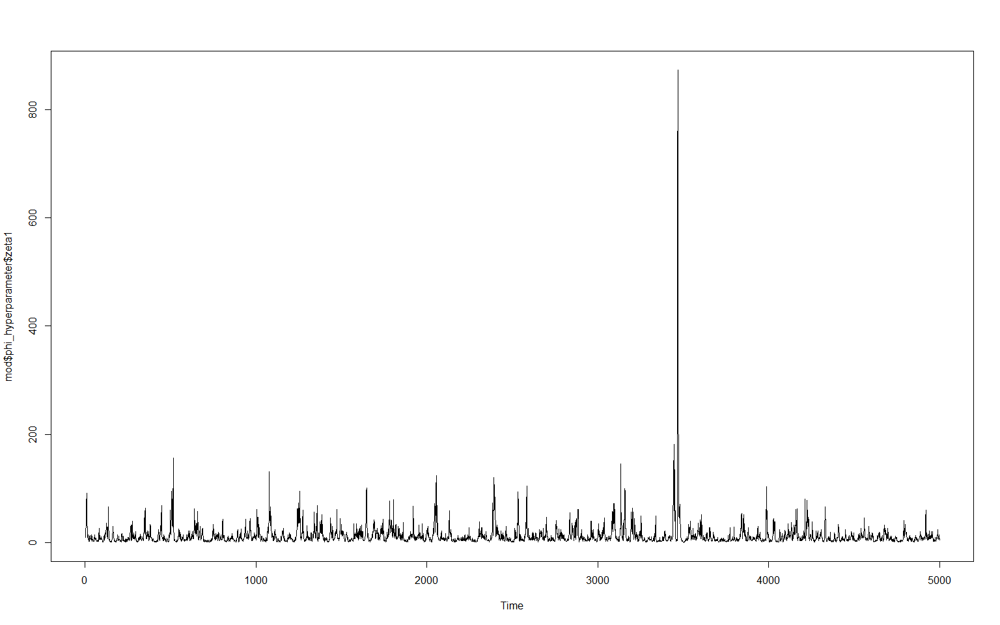
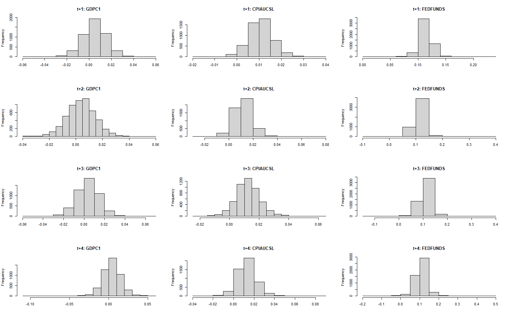

bayesianVARs: Hierarchical shrinkage priors
================
Luis Gruber
16 5 2022

Estimation of Bayesian vectorautoregressions. Implements several modern
hierarchical shrinkage priors, amongst them
-induced-Dirichlet-decomposition
(R2D2) prior, Dirichlet-Laplace (DL) prior, Stochastic Search Variable
Selection (SSVS) and the Hierarchical Minnesota prior.

# Installation

Install directly from GitHub.

``` r
devtools::install_github("luisgruber/bayesianVARs")
```

# Getting started

``` r
# load package
library(bayesianVARs)

# Some data (from FRED-MD database)
data <- dat_growth[,c("GDPC1", "CPIAUCSL", "FEDFUNDS")]

# Data for estimation
Y_est <- data[1:100,]

# Specify prior for reduced-form VAR coefficients (with default settings)
prior <- "R2D2" # or "DL", "SSVS", "HMP", "normal"
priorPHI <- specify_priorPHI(prior = "R2D2")

# Specify prior for L (Decomposition of variance-covariance matrix in the form of t(L^(-1))%*%D_t%*%L^(-1), where L is upper triangular)
priorL <- specify_priorL(prior = "DL")

# Estimate VAR(2) with stochastic volatitlity
mod <- bvar(Yraw = Y_est, p = 2, draws = 5000, burnin = 1000,
            priorPHI = priorPHI, priorL = priorL, SV = TRUE, progressbar = TRUE)

# Posterior summary of PHI
summary(mod)
```

    ## 
    ## Posterior median of PHI:
    ##                  GDPC1   CPIAUCSL   FEDFUNDS
    ## GDPC1.l1     4.705e-21  2.092e-12  5.331e-11
    ## CPIAUCSL.l1 -3.209e-07  7.077e-01  1.142e-01
    ## FEDFUNDS.l1 -1.659e-06  2.936e-02  1.270e+00
    ## GDPC1.l2     1.105e-11 -6.636e-22  2.031e-13
    ## CPIAUCSL.l2 -1.006e-08  9.085e-02  5.309e-11
    ## FEDFUNDS.l2 -2.987e-02 -6.341e-07 -3.263e-01
    ## intercept    1.611e-02  8.160e-04  1.675e-03
    ## 
    ## Posterior interquartile range of PHI:
    ##                 GDPC1  CPIAUCSL  FEDFUNDS
    ## GDPC1.l1    7.218e-05 5.237e-04 0.0179714
    ## CPIAUCSL.l1 2.067e-01 2.431e-01 0.3371642
    ## FEDFUNDS.l1 2.860e-02 1.103e-01 0.1907421
    ## GDPC1.l2    3.455e-04 3.063e-05 0.0005711
    ## CPIAUCSL.l2 2.947e-02 2.785e-01 0.0011570
    ## FEDFUNDS.l2 1.118e-01 8.357e-02 0.1812153
    ## intercept   3.283e-03 1.242e-03 0.0021808

``` r
# Traceplot of global shrinkage parameter
ts.plot(mod$phi_hyperparameter$zeta1)
```

<!-- -->

``` r
# Simulate from predictive density and compare to ex-post realized value by means
# log predictive likelihood
Y_obs <- data[101:104,]
pred <- predict(mod, nsteps = 4, LPL = TRUE, Y_obs = Y_obs ,LPL_VoI = c("CPIAUCSL", "FEDFUNDS"))

# Histograms of predictive densities
par(mfrow=c(4,3))
for (i in paste0("t+",1:4)) {
  for(j in c("GDPC1" ,"CPIAUCSL", "FEDFUNDS")){
  hist(pred$predictions[,i,j], main = paste0(i,": ",j), xlab = "")
}
}
```

<!-- -->

``` r
# Summary of predictive evaluation
summary(pred)
```

    ## 
    ## LPL:
    ##   t+1   t+2   t+3   t+4 
    ## 9.437 9.385 9.428 9.110 
    ## 
    ## Marginal joint LPL of CPIAUCSL & FEDFUNDS:
    ##   t+1   t+2   t+3   t+4 
    ## 5.833 5.856 5.816 5.812 
    ## 
    ## Marginal univariate LPLs:
    ##     GDPC1 CPIAUCSL FEDFUNDS
    ## t+1 3.647    4.344    1.457
    ## t+2 3.570    4.119    1.683
    ## t+3 3.588    3.936    1.778
    ## t+4 3.181    3.580    1.952
    ## 
    ## Prediction quantiles:
    ## , , GDPC1
    ## 
    ##           t+1      t+2       t+3       t+4
    ## 5%  -0.011507 -0.01241 -0.012545 -0.012727
    ## 50%  0.006661  0.00553  0.005558  0.005395
    ## 95%  0.023956  0.02330  0.023269  0.023926
    ## 
    ## , , CPIAUCSL
    ## 
    ##          t+1       t+2       t+3       t+4
    ## 5%  0.001736 0.0004717 -0.001208 -0.002108
    ## 50% 0.010499 0.0111807  0.011831  0.012239
    ## 95% 0.019816 0.0229956  0.025614  0.027502
    ## 
    ## , , FEDFUNDS
    ## 
    ##         t+1    t+2    t+3     t+4
    ## 5%  0.09502 0.0777 0.0622 0.04942
    ## 50% 0.11431 0.1125 0.1102 0.10784
    ## 95% 0.13000 0.1398 0.1482 0.15611
